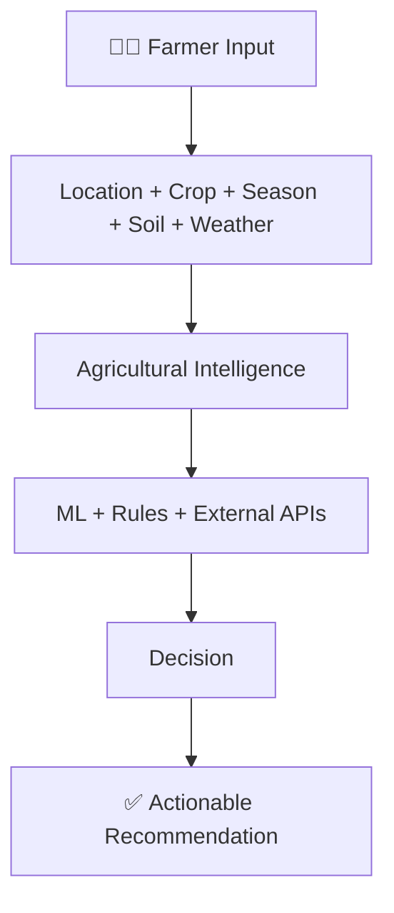
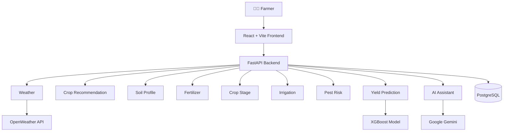
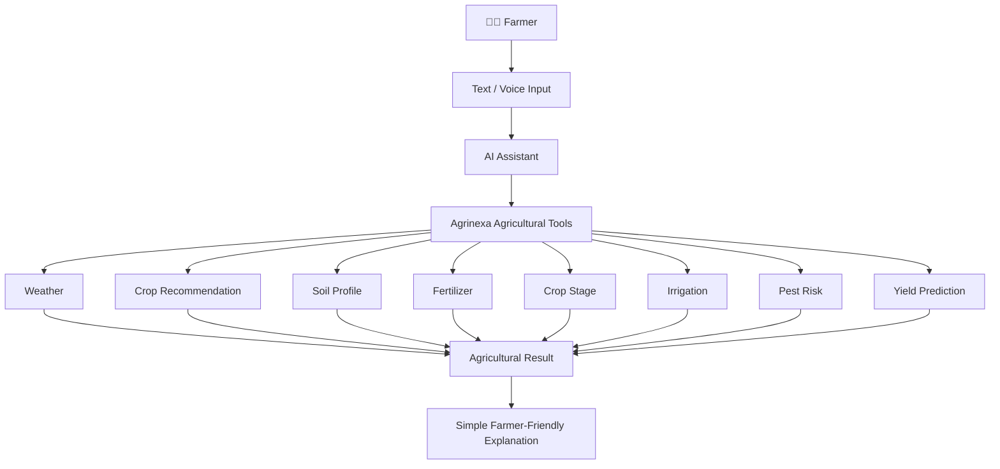
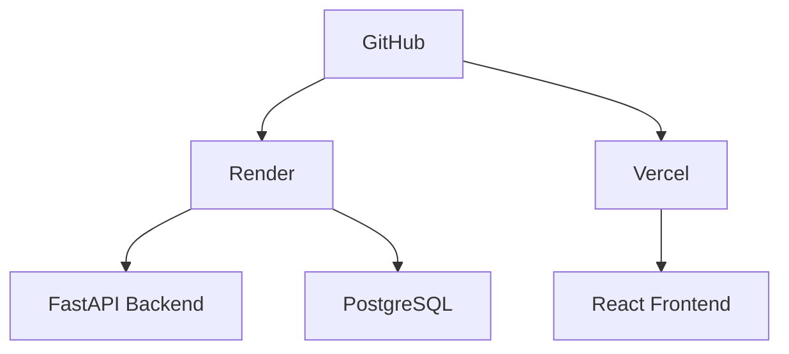

<div align="center">


# 🌱 Agrinexa AI

### Smarter Farms. Better Futures.

**An AI-Powered Climate-Smart Farming Decision Support System for Sustainable Agriculture**

Agrinexa AI is an intelligent agriculture decision-support platform that helps farmers make better farming decisions by combining agricultural data, live weather, machine learning, and AI, turning scattered information into practical, understandable recommendations.

<br />


<!--
Add repository badges here once the repo URL is final, e.g. stars, forks, issues, license.
Example (replace <owner>/<repo>):

-->

<br />

[Features](#-features) •
[How It Thinks](#-how-agrinexa-thinks) •
[Architecture](#-system-architecture) •
[ML Model](#-yield-prediction-model) •
[Datasets](#-datasets) •
[Tech Stack](#-tech-stack) •
[Setup](#-getting-started)

</div>

---

## 💡 The Idea

> **"Most systems show information. Agrinexa connects information into decisions."**

Farmers regularly face decisions that depend on data scattered across many sources. Agrinexa AI brings those decisions together in one platform and answers them in simple, actionable language.

| Farmer's question | Agrinexa module |
|---|---|
| Which crop should be grown? | Crop Recommendation |
| When should the crop be sown? | Crop Stage Intelligence |
| What is the current weather condition? | Live Weather |
| What type of soil is suitable? | Soil Profile |
| Which fertilizer should be used? | Fertilizer Recommendation |
| When should irrigation be done? | Irrigation Advisory |
| What is the current crop growth stage? | Crop Stage Intelligence |
| What is the risk of pests and diseases? | Pest & Disease Risk |
| What yield can be expected? | Yield Prediction |

> 🌾 *We are not building AI to replace the farmer. We are building AI to help the farmer make the next decision with better information.*

---

## ✨ Features

| 🌦️ Weather | 🌱 Crop Recommendation | 🧪 Soil Profile |
|---|---|---|
| Live weather insights | Historical crop recommendations | Regional soil estimation |

| 🌾 Fertilizer | 💧 Irrigation | 🐛 Pest Risk |
|---|---|---|
| Nutrient-based recommendations | Crop-stage advisory | Environmental risk assessment |

| 📊 Yield Prediction | 🤖 AI Assistant | 📅 Crop Stage |
|---|---|---|
| XGBoost-based prediction | Tool-augmented conversational AI | Stage-specific actions |

### Feature details

<details>
<summary><b>🌦️ Live Weather</b></summary>

<br />

Uses the **OpenWeather API** to provide:

- Temperature
- Humidity
- Wind speed
- Current rainfall
- Cloud percentage
- Weather condition

</details>

<details>
<summary><b>🌱 Crop Recommendation</b></summary>

<br />

Built on historical agricultural production data. It considers:

- District
- Season
- Historical crop occurrence
- Regional soil compatibility

The recommendation combines historical crop records with available regional soil information.

> ⚠️ The historical score is **not** a probability of crop success or a yield probability.

</details>

<details>
<summary><b>🧪 Soil Profile</b></summary>

<br />

Provides an **estimated regional soil profile** using agricultural fertilizer/soil data:

- Soil type
- Nitrogen (N)
- Phosphorus (P)
- Potassium (K)
- pH

> ⚠️ **Disclaimer:** The regional soil profile is an estimate and should not replace laboratory soil testing.

</details>

<details>
<summary><b>🌾 Fertilizer Recommendation</b></summary>

<br />

Analyzes soil nutrient conditions and available fertilizer information, considering:

- Nitrogen
- Phosphorus
- Potassium
- pH
- Crop requirements

</details>

<details>
<summary><b>📅 Crop Stage Intelligence</b></summary>

<br />

The farmer provides the **crop** and **sowing date**. Agrinexa calculates the approximate crop age, identifies the current growth stage, and provides actions related to:

- Vegetative growth
- Flowering
- Fruiting / grain development
- Crop monitoring
- Nutrient requirements

</details>

<details>
<summary><b>💧 Irrigation Advisory</b></summary>

<br />

Uses the following inputs to provide **irrigation priority** and practical guidance:

- Crop
- Crop growth stage
- Rainfall
- Temperature
- Humidity

</details>

<details>
<summary><b>🐛 Pest & Disease Risk</b></summary>

<br />

Estimates risk using:

- Humidity
- Rainfall
- Temperature
- Crop stage

Provides a risk level, monitoring advice, and preventive guidance.

> ⚠️ This is a **rule-based environmental risk advisory**, not image-based disease detection.

</details>

<details>
<summary><b>📊 Yield Prediction</b></summary>

<br />

Uses an **XGBoost Regressor** for the currently supported crops: Rice, Maize, Chickpea, and Cotton. See [Yield Prediction Model](#-yield-prediction-model) for features and evaluation results.

</details>

<details>
<summary><b>🤖 AI Agricultural Assistant</b></summary>

<br />

Lets farmers interact with the system in natural language, through text or voice input. The assistant is a **tool-augmented conversational layer** connected to Agrinexa's agricultural intelligence modules: it calls those modules to get results, then explains them in simple, farmer-friendly language. See [AI Assistant Architecture](#-ai-assistant-architecture).

</details>

<details>
<summary><b>🌐 Multilingual Interface</b></summary>

<br />

The application supports **English**, **Hindi**, and **Marathi**. The selected language is used throughout the application interface.

</details>

---

## 🧠 How Agrinexa Thinks

Agrinexa takes a few simple inputs from the farmer (location, crop, season) and combines them with soil information and live weather. Machine learning models, rule-based logic, and external APIs then work together to produce a decision, which is delivered as an actionable recommendation rather than raw data.



---

## 🏗️ System Architecture



### 🤖 AI Assistant Architecture

The assistant is not a standalone chatbot. It sits on top of Agrinexa's agricultural tools and uses them to ground its answers.



### 🚀 Deployment Architecture



---

## 📊 Yield Prediction Model

| | |
|---|---|
| **Model** | XGBoost Regressor |
| **Task** | Crop yield prediction |
| **Supported crops** | Rice, Maize, Chickpea, Cotton |

**Input features**

- Area
- Year
- Temperature
- Humidity
- pH
- Rainfall
- Wind speed
- Engineered weather features

**Evaluation results**

| Metric | Result |
|---|---:|
| MAE | ~372.81 |
| RMSE | ~529.84 |
| R² | ~0.56 |

> ⚠️ These metrics represent evaluation results on the project's dataset and should not be interpreted as a guaranteed prediction accuracy. Yield predictions are estimates, not guaranteed outcomes.

---

## 🗂️ Datasets

Agrinexa uses multiple agricultural datasets:

| Dataset | Used for |
|---|---|
| `crop_production_yield.csv` | Historical crop analysis, crop recommendation, district and season analysis |
| `crop_weather_yield.csv` | Yield prediction, environmental analysis |
| `crop_fertilizer.csv` | Soil profile estimation, nutrient analysis, fertilizer recommendation |
| `crop_knowledge.csv` | Crop growth stages, sowing periods, stage-specific farming actions |

---

## 🧰 Tech Stack

| Layer | Technologies |
|---|---|
| **Frontend** | React, Vite, JavaScript, CSS |
| **Backend** | Python, FastAPI, SQLAlchemy, PostgreSQL, Pydantic |
| **Machine Learning** | Python, Pandas, NumPy, Scikit-learn, XGBoost, Joblib |
| **AI** | Google Gemini |
| **External API** | OpenWeather API |
| **Database** | PostgreSQL |
| **Deployment** | GitHub, Render, Vercel |

---

## ⚙️ Getting Started

> 📝 **Note:** Replace the placeholders below (repository URL, file names, commands, and environment variable names) with the ones that match your actual project setup.

### Prerequisites

- Node.js and npm (for the frontend)
- Python (for the backend and ML components)
- A PostgreSQL database
- An [OpenWeather API](https://openweathermap.org/api) key
- A Google Gemini API key

### 1. Clone the repository

```bash
git clone <your-repository-url>
cd <your-project-folder>
```

### 2. Backend (FastAPI)

```bash
cd <backend-folder>

# Create and activate a virtual environment
python -m venv venv
source venv/bin/activate        # Windows: venv\Scripts\activate

# Install dependencies
pip install -r requirements.txt

# Start the FastAPI server
uvicorn <module>:app --reload
```

### 3. Frontend (React + Vite)

```bash
cd <frontend-folder>
npm install
npm run dev
```

### 4. Environment variables

Configure the credentials the project needs. Use the variable names your project actually reads.

| Purpose | Example variable |
|---|---|
| PostgreSQL connection | `DATABASE_URL` |
| OpenWeather API key | `OPENWEATHER_API_KEY` |
| Google Gemini API key | `GEMINI_API_KEY` |

> 🔒 Never commit API keys or database credentials to the repository.

---

## 🧭 Responsible Use & Limitations

Agrinexa AI is a decision-support tool. It is designed to inform farmers, not to replace their judgment or professional advice.

- **Crop recommendation:** the historical score is not a probability of crop success or yield.
- **Soil profile:** an estimated regional profile; it does not replace laboratory soil testing.
- **Pest & disease risk:** a rule-based environmental advisory, not image-based disease detection.
- **Yield prediction:** limited to Rice, Maize, Chickpea, and Cotton, with moderate explanatory power (R² ≈ 0.56 on the project's dataset). Not a guaranteed yield.
- **AI assistant:** explains results produced by Agrinexa's modules in simple language; its answers should be treated as guidance.

---

<div align="center">

### 🌱 Agrinexa AI

*Smarter Farms. Better Futures.*

<sub>We are not building AI to replace the farmer. We are building AI to help the farmer make the next decision with better information.</sub>

</div>
